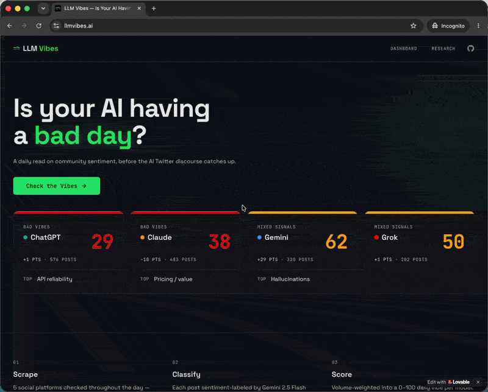

# LLM Vibes 🌊

AI sentiment dashboard updated throughout the day for Claude, ChatGPT, Gemini, and Grok. Is your AI having a bad day?

[](LICENSE)
[](https://www.typescriptlang.org/)
[](https://reactjs.org/)
[](https://supabase.com/)
[](CONTRIBUTING.md)

<a href="https://llmvibes.ai">
  
</a>

## Why this exists

Every day, thousands of developers share their real experiences with AI models across Reddit, Hacker News, Bluesky, Mastodon, and more. But there's no easy way to see the big picture: which models are loved, which are frustrating people, and what's trending.

**LLM Vibes** scrapes 5 social platforms, classifies sentiment with AI, and scores each model in daily 0-100 windows that refresh throughout the day. No surveys, no voting — just real conversations from real developers.

## Features

- 📊 **Vibes dashboard updated throughout the day** for 4 AI models (Claude, ChatGPT, Gemini, Grok)
- 📈 **30-day historical charts** with per-model detail pages
- 🏷️ **Complaint breakdowns** — lazy responses, hallucinations, refusals, coding quality, speed, general drop, pricing/value, censorship, context window, API reliability, multimodal quality, reasoning
- 🌐 **Source diversity tracking** across 5 platforms
- ⚡ **Automated pipeline** with source-specific scrape windows throughout the day — no manual intervention needed
- 🔍 **Keyword matching** + AI relevance filtering to reduce noise
- 🌍 **Auto-translation** of non-English posts for global coverage

## Data Sources

| Source | Method | Auth Required |
|--------|--------|--------------|
| Reddit | Apify scraper | API token |
| Hacker News | Algolia Search API | None |
| Twitter/X | Apify scraper | API token |
| Bluesky | AT Protocol search | App password |
| Mastodon | Public hashtag timelines (5 instances) | None |

## Tech Stack

| Layer | Technology |
|-------|-----------|
| Framework | React 18.3 + TypeScript 5.8 |
| Build | Vite 5.4 (SWC plugin) |
| Routing | React Router 6 (lazy-loaded pages) |
| UI | shadcn/ui (Radix + Tailwind CSS) |
| Charts | Recharts 2.15 |
| State | TanStack React Query 5 |
| Animations | Framer Motion 12 |
| Backend | Supabase (PostgreSQL + Edge Functions) |
| Sentiment AI | Gemini 2.5 Flash by default via Google AI API |

## Getting Started

1. Clone the repo
   ```bash
   git clone https://github.com/dkships/llm-moods.git
   cd llm-moods
   ```
2. Copy `.env.example` to `.env` and fill in your Supabase credentials
3. Install dependencies
   ```bash
   npm install
   ```
4. Start the dev server
   ```bash
   npm run dev
   ```

> **Note:** The scraping edge functions run on Supabase and require their own setup with secrets for API keys (Bluesky, Apify, etc). See `supabase/functions/` for details.

## Project Structure

```
src/
├── components/     # React components (model cards, charts, chatter feed)
├── hooks/          # React Query hooks for data fetching
├── pages/          # Route pages (landing, dashboard, model detail)
├── lib/            # Utilities, constants, sentiment scale
└── integrations/   # Supabase client config (auto-generated types)

supabase/
├── functions/      # 14 deployable Deno edge functions (5 active scrapers + utilities)
└── migrations/     # Database schema migrations
```

## Contributing

Contributions welcome! See [CONTRIBUTING.md](CONTRIBUTING.md) for setup instructions, contribution ideas, and guidelines for adding new scrapers or models.

## License

[MIT](LICENSE)

## Author

Built by [David Kelly](https://dmkthinks.org)
